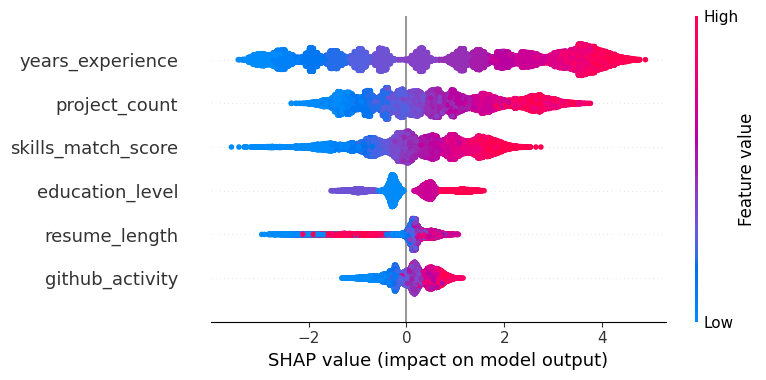

# 🤖 AI Resume Screening Agent (30k Candidate Scale)

An end-to-end Machine Learning pipeline built to predict candidate shortlisting outcomes with **90.83% accuracy**. This project focuses on model explainability to ensure ethical and logical hiring decisions.

## � Dataset
This project uses the **AI-Driven Resume Screening Dataset** from Kaggle:
- **Dataset Link:** [AI-Driven Resume Screening Dataset](https://www.kaggle.com/datasets/sonalshinde123/ai-driven-resume-screening-dataset)
- **Size:** 30,000+ candidate records
- **Features:** Education level, years of experience, skills match score, project count, resume length, GitHub activity

## 🚀 Key Results
- **Accuracy:** 90.83%
- **Recall:** 0.94 (High efficiency in identifying qualified talent)
- **Model Explainability:** Implemented **SHAP** to verify that the model prioritizes skills and experience over resume length.

## 📈 Model Explanation - SHAP Summary Plot

The following plot shows which features have the most impact on the model's decisions:



**Key Insights:**
- ✅ The model prioritizes **skills_match_score** and **years_experience**
- ✅ Ethical AI: Doesn't rely on resume length for decisions
- ✅ Transparent decisions backed by SHAP analysis

## 🛠️ Project Structure
```
├── main.py                    # Main pipeline orchestrator
├── eda.py                     # Exploratory Data Analysis
├── src/
│   ├── preprocessor.py        # Data cleaning & scaling
│   ├── train.py               # Model training (XGBoost)
│   └── resume_model.pkl       # Trained model
├── explain.py                 # SHAP model explanation
├── model_explanation.png      # SHAP visualization
├── RESUME_DATA/
│   └── ai_resume_screening.csv # 30k dataset
└── .gitignore                 # Git configuration
```

## 🛠️ How to Run

### 1. Clone the Repository
```bash
git clone https://github.com/dv919/Resume_AI_Agent.git
cd Resume_AI_Agent
```

### 2. Set Up Virtual Environment
```bash
python -m venv .venv
.\.venv\Scripts\activate  # Windows
# or
source .venv/bin/activate  # Mac/Linux
```

### 3. Install Dependencies
```bash
pip install -r requirements.txt
```

Or manually install:
```bash
pip install pandas xgboost shap scikit-learn matplotlib joblib
```

### 4. Download the Dataset
Download from [Kaggle](https://www.kaggle.com/datasets/sonalshinde123/ai-driven-resume-screening-dataset) and place `ai_resume_screening.csv` in the `RESUME_DATA/` folder.

### 5. Run the Pipeline
```bash
python main.py          # Run the full pipeline
python eda.py           # Exploratory data analysis
python src/train.py     # Train the model
python explain.py       # Generate SHAP explanations
```

## 📊 Model Architecture
- **Algorithm:** XGBoost Classifier
- **Hyperparameters:**
  - Trees: 100
  - Max Depth: 5
  - Learning Rate: 0.1
  - Evaluation Metric: Log Loss
- **Train/Test Split:** 80/20

## 🎯 Features Used
1. **Education Level** (encoded)
2. **Years of Experience** (scaled)
3. **Skills Match Score** (scaled)
4. **Project Count** (scaled)
5. **Resume Length** (scaled)
6. **GitHub Activity** (scaled)

## ✨ Key Technologies
- **Python 3.12**
- **pandas** - Data manipulation
- **scikit-learn** - Preprocessing & metrics
- **XGBoost** - Model training
- **SHAP** - Model explainability
- **matplotlib** - Visualizations

## 📄 License
This project is open source and available under the MIT License.

## 🤝 Contributing
Feel free to fork, submit issues, and make pull requests!

## 📧 Contact
For questions or suggestions, reach out on GitHub.
